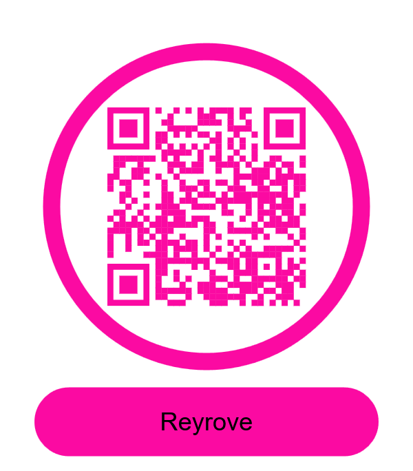

<h1 align="center">REYROVE'S WORLD</h1>

<em>Where science, art, and tech collide in neon glory.</em>

   
  <i>✨ Scan to jump straight into Reyrove’s neon universe ✨</i>

  
  
  
  

---

<h2 align="center">📚 Table of Contents</h2>

  <a href="#-who-is-reyrove">Who is Reyrove?</a> • 
  <a href="#-why-should-you-care">Why Should You Care?</a> • 
  <a href="#-whats-on-the-menu">What’s on the Menu?</a> • 
  <a href="#-contributing">Contributing</a> • 
  <a href="#-license">License</a> • 
  <a href="#-contact">Contact</a> • 
  <a href="#-follow-the-magic">Follow the Magic</a>

---

<h2>🤔 WHO IS REYROVE?</h2>

Let’s cut to the chase — <strong>Rey</strong> is not your average coder. 😏

<ul>
  <li>🧵💻 Textile Engineer turned Web Sorceress</li>
  <li>🖼️ Generative Artist redefining the NFT game</li>
  <li>🤖✨ AI Explorer with a badass sidekick, <em>Sparrow Hawk</em></li>
  <li>💥🔧 Code Ninja who breaks things just to rebuild them better</li>
</ul>

From <strong>Polymer Science</strong> to <strong>LAMMPS</strong>, <strong>FORTRAN</strong>, and <strong>Web3</strong>, every line of code is both sexy and genius.

---

<h2>🤨 WHY SHOULD YOU CARE?</h2>

If you’re reading this, congratulations — you’re already part of the cool club. 🍸

Whether it’s <strong>mind-bending generative art</strong>, <strong>sleek websites</strong>, or <strong>AI-powered creations</strong>, 
<strong>Reyrove = innovation with edge</strong>.

---

<h2>🍽️ WHAT’S ON THE MENU?</h2>

<ul>
  <li>✨ <strong>Generative Art & NFTs</strong> 
  Check me out on <a href="https://www.fxhash.xyz/">fxhash</a>, <a href="https://opensea.io/">OpenSea</a>, and <a href="https://www.artblocks.io/">ArtBlocks</a></li> 

  <li>💻 <strong>Web Development</strong> 
  Gorgeous, responsive, accessible, optimized — JavaScript, HTML, CSS, React, you name it.</li> 

  <li>📚 <strong>Educational Goodies</strong> 
  Tutorials on <strong>FORTRAN</strong>, <strong>LaTeX</strong>, <strong>JavaScript</strong>, and more.</li> 

  <li>🧪 <strong>Molecular Dynamics Simulations</strong> 
  Deep-dive into <strong>LAMMPS</strong> magic — real-time modeling, atomistic precision.</li>
</ul>

---

<h2>🤝 CONTRIBUTING</h2>

Wanna collab? I welcome pull requests, issues, and cool ideas.  
Make sure to:

<ol>
  <li>Fork this repo 🍴</li>
  <li>Create your feature branch (<code>git checkout -b feature/neon-enhance</code>)</li>
  <li>Commit your changes (<code>git commit -m 'Add some sparkle ✨'</code>)</li>
  <li>Push to the branch (<code>git push origin feature/neon-enhance</code>)</li>
  <li>Open a Pull Request 👯</li>
</ol>

Let’s build something wild together.

---

<h2>📄 LICENSE</h2>

This project is <strong>free to use, remix, and build upon</strong>, even for commercial purposes.  

🚨 <strong>Just one thing</strong>: <em>Give credit</em> where credit's due. 
If you use my work, <strong>mention "Reyrove"</strong> somewhere in your project or documentation. 
That's all I ask. 💖

---

<h2>💬 CONTACT</h2>

📧 <a href="mailto:reyhanehdaneshdoost@gmail.com">Email me</a> 
Or stalk me like a proper fan across social media 🔍

---

## ✨ FOLLOW THE MAGIC

  
  
  
  

  
---

  <em>“Code is my spellbook. Creativity is my wand.” — Reyrove 💗</em>

